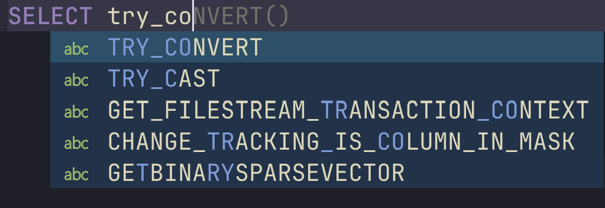
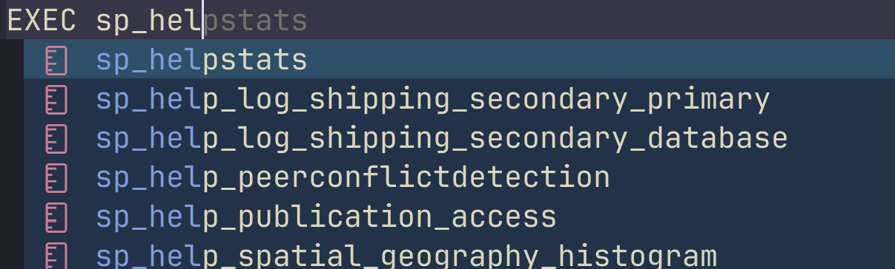
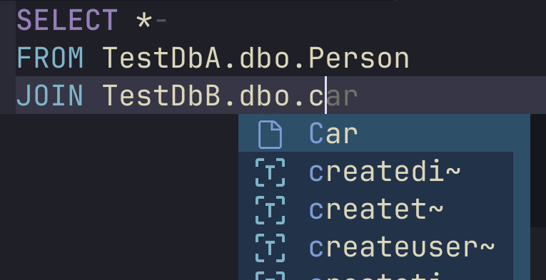
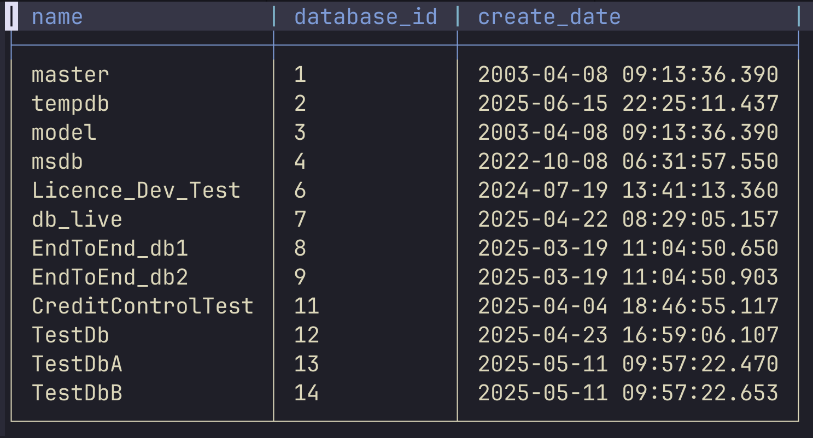
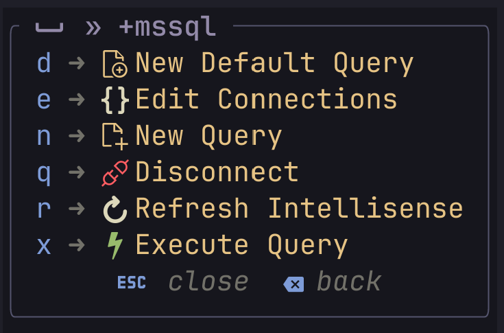
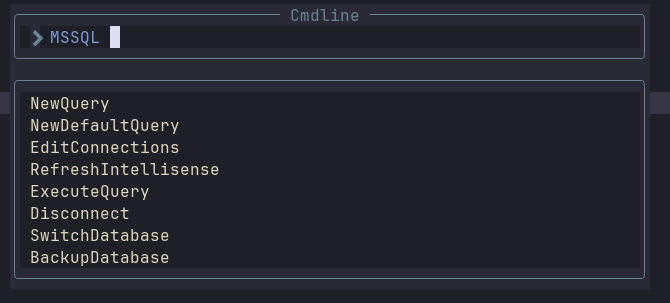

# mssql.nvim

<p align="center" >

</p>

<p align="center" >
An SQL Server plugin for neovim. Like it? Give a ⭐️!
</p>

## Features

Completions, including TSQL keywords,



stored procedures



and cross database queries



Execute queries, with results in markdown tables for automatic colouring and
rendering



User commands and optional which-key integration, showing only the key
maps/commands which are possible (eg don't show `Connect` if we are already
connected)





Lualine integration


Other cherries on top:

- Backup to/restore from `.bak` files
- Basic TSQL formatting

## Installation and setup

Requires Neovim v0.11.0 or later.

For keymaps, choose a prefix, eg `<leader>m`. Make sure it doesn't clash with
any existing keymaps/which-key groups!

<details>
<summary>lazy.nvim</summary>

```lua
{
  "Kurren123/mssql.nvim",
  opts = {
    -- optional
    keymap_prefix = "<leader>m"
  },
  -- optional
  dependencies = { "folke/which-key.nvim" }
}
```

</details>

<details>
<summary>Packer</summary>

```lua
require("packer").startup(function()
  use({
    "Kurren123/mssql.nvim",
    -- optional
    requires = { 'folke/which-key.nvim' },
    config = function()
      require("mssql").setup({ keymap_prefix = "<leader>m" })
    end,
  })
end)
```

</details>

<details>
<summary>Paq</summary>

```lua
require("paq")({
  "savq/paq-nvim",
  "Kurren123/mssql.nvim",
  -- optional
  "folke/which-key.nvim",
})

require("mssql").setup({
  -- optional
  keymap_prefix = "<leader>m",
})
```

</details>

<details>
<summary>No package manager</summary>

Clone this repo, then:

```lua
-- Prepend plugin root to runtimepath
vim.opt.rtp:prepend("/path/to/mssql.nvim/")
require("mssql").setup({
  -- optional
  keymap_prefix = "<leader>m",
})
```

</details>

All mssql keymaps are set up with the prefix first. In the above example, new
query would be `<leader>mn`. If you have which-key installed, then the prefix
you provide will be a which-key group.

### Lualine

Insert `require("mssql").lualine_component` into a lualine section (eg
`lualine_c`).

Eg lazyvim:

```lua
return {
  "nvim-lualine/lualine.nvim",
  dependencies = { "Kurren123/mssql.nvim" },
  opts = function(_, opts)
    table.insert(opts.sections.lualine_c, require("mssql").lualine_component)
    return opts
  end,
}
```

Or Lazy.nvim (without lazyvim):

```lua
return {
  "nvim-lualine/lualine.nvim",
  dependencies = { "Kurren123/mssql.nvim" },
  opts = {
      sections = {
        lualine_c = {
          require('mssql').lualine_component,
        },
      },
    },
}
```

</details>

### Other status lines (eg heirline)

You can also use `require('mssql').lualine_component` in other status lines or
customise your own (see
<https://github.com/Kurren123/mssql.nvim/issues/56#issuecomment-2912516957>).
It's a table with the following:

```lua
{
  [1] = function()
        -- returns a string of the status
        end,
  cond = function()
         -- returns a bool, of whether to show this status line
         end
}
```

So eg a [heirline](https://github.com/rebelot/heirline.nvim) component would
look like:

```lua
local lualine_component = require("mssql").lualine_component
local mssql_heirline_component = {
 provider = lualine_component[1],
 condition = lualine_component.cond,
}
```

`mssql.nvim` calls `vim.cmd("redrawstatus")` whenever the status changes, so you
don't need to worry about refreshing

### Using a keymap that gets overridden later (eg lazyvim)

Lazyvim sets its keymaps after loading the `mssql` plugin. If you want to use a
keymap that lazyvim already uses:

1. Call `setup()` without a `keymap_prefix`
2. In your `keymaps.lua` file, delete the lazyvim keymaps then call
   `set_keymaps`. Eg:

   ```lua
   -- delete lua profiler keymaps first
   safe_delete("n", "<leader>dpp")
   safe_delete("n", "<leader>dph")
   safe_delete("n", "<leader>dps")
   require("mssql").set_keymaps("<leader>d")
   ```

## Usage

You can call the following as key maps typing your
[prefix](#installation-and-setup) first, as user commands by doing
`:MSSQL <command>` or as functions on `require("mssql")`.

| Key Map | User Command          | Function                       | Description                                                                                                                                                                       |
| ------- | --------------------- | ------------------------------ | --------------------------------------------------------------------------------------------------------------------------------------------------------------------------------- |
| `n`     | `NewQuery`            | `new_query()`                  | Open a new buffer for sql queries                                                                                                                                                 |
| `c`     | `Connect`             | `connect()`                    | Connect the current buffer (you'll be prompted to choose a connection)                                                                                                            |
| `x`     | `ExecuteQuery`        | `execute_query()`              | Execute the selection, or the whole buffer                                                                                                                                        |
| `q`     | `Disconnect`          | `disconnect()`                 | Disconnects the current buffer                                                                                                                                                    |
| `s`     | `SwitchDatabase`      | `switch_database()`            | Prompts, then switches to a database that is on the currently connected server                                                                                                    |
| `d`     | `NewDefaultQuery`     | `new_default_query()`          | Opens a new query and connects to the connection called `default` in your `connections.json`. Useful when combined with the `promptForDatabase` option in the `connections.json`. |
| `r`     | `RefreshIntellisense` | `refresh_intellisense_cache()` | Rebuild the intellisense cache                                                                                                                                                    |
| `e`     | `EditConnections`     | `edit_connections()`           | Open the [connections file](#connections-json-file) for editing                                                                                                                   |
|         | `BackupDatabase`      | `backup_database()`            | Inserts an SQL command to back up the currently connected database                                                                                                                |
|         | `RestoreDatabase`     | `restore_database()`           | Prompts for a `.bak` file, then inserts an SQL command to restore the database from that file                                                                                     |

## Connections json file

The format is `"connection name": connection object`. Eg:

```json
{
  "Connection A": {
    "server": "localhost",
    "database": "dbA",
    "authenticationType": "SqlLogin",
    "user": "Admin",
    "password": "Your_Password",
    "trustServerCertificate": true
  },
  "Connection B": {
    "server": "AnotherServer",
    "database": "dbB",
    "authenticationType": "Integrated",
    "promptForDatabase": true
  }
}
```

Each connection object takes
[standard connection properties](docs/Connections-Json.md). On top of those, you
can also provide these useful properties:

| Property            | Type   | Description                                                                       |
| ------------------- | ------ | --------------------------------------------------------------------------------- |
| `promptForDatabase` | `bool` | After connecting to the server, select which database to connect to.              |
| `promptForPassword` | `bool` | Ask for the password each time you connect instead of storing it in the json file |

## Options

Setup with options:

```lua
require("mssql").setup({
  keymap_prefix = "<leader>m",
  max_rows = 50,
  max_column_width = 50
})

-- With callback
require("mssql").setup({
  keymap_prefix = "<leader>m",
  max_rows = 50,
  max_column_width = 50,
}, function()
  print("mssql.nvim is ready!")
end)
```

See
[here](https://github.com/Kurren123/mssql.nvim/blob/main/lua/mssql/default_opts.lua)
for all options and defaults

### Notes

- `setup()` runs asynchronously as it may take some time to first download and
  extract the sql tools. Pass a callback as the second argument if you need to
  run code after initialization.
- Formatting options are passed into the option's `lsp_settings`
